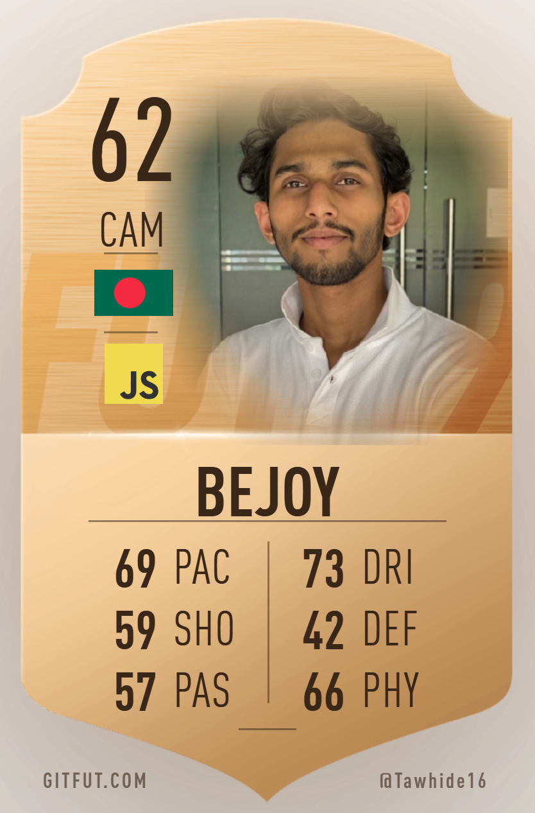

  

 

  &nbsp;
  &nbsp;
  &nbsp;
  

 

  
  

---

## ⚽ Player Profile

<table>
<tr>
<td valign="top" width="70%">

- 🎽 **Position:** Full-Stack Developer — the No.10 Playmaker of code
- 🛍️ **Current Club:** Shopify Theme Developer at **Softvence IT Ltd.**
- 💧 **Signature Move:** Custom sections with **Liquid** & **Ruby** templates
- ⚛️ **Skill Moves:** **React.js**, **Next.js**, **Node.js**, **Tailwind CSS**
- 🎓 **Academy Training:** Pursuing **Diploma in Computer Science**
- 🎯 **Playing Style:** Pixel-perfect UI/UX and clean, tiki-taka code
- 💬 **Press Conference Topics:** **Shopify**, **Liquid**, **React.js**, **Full-Stack Dev**
- ⚡ **Pre-Match Ritual:** Coffee ☕ + late-night vibes 🌙 = fastest debugging
- ✨ **Motto:** Every pixel matters — I play for **perfection**, not draws!

<td valign="top" width="30%">

</td>
</tr>
</table>

---

## 🏆 Golden Boot Skills — Shopify & E-Commerce

---

## 🏟️ Starting Lineup — Full Tech Stack

### ⚡ Attackers (Frontend)

### 🧠 Midfield Engine (Backend)

### 🛡️ Defense (Database)

### 🧤 Goalkeeper & Coaching Staff (Tools)

---

## 📊 Match Stats

  
  

  

---

## 📈 Season Form — Contribution Graph

  

---

## 🏆 Trophy Cabinet

  

---

## 📣 Post-Match Interview — Dev Quote

  

---

  <b>⭐ Enjoyed the match? Drop a star on my repositories — every fan counts! 🎉</b> 
  ⚽ Made with ❤️ (and extra time) by Tawhid Hasan Bejoy — World Cup Edition 2026 🏆

